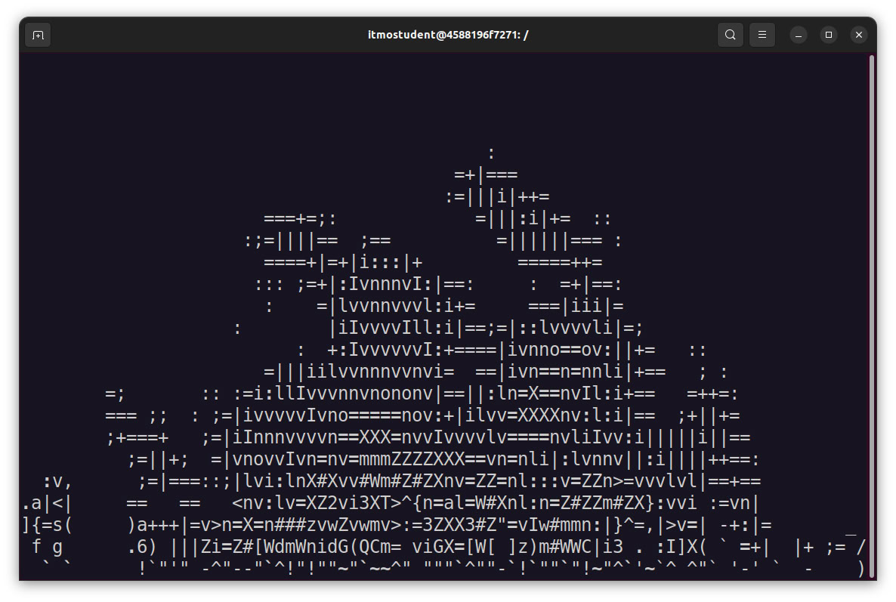

Участники: Крестьянова Елизавета, Дашкевич Олеся.
# Docker compose
## "Плохой" Docker compose
> Написать “плохой” Docker compose файл, в котором есть не менее трех “bad practices” по их написанию
> 
```
version: "3"

services:
  web:
    build: .
    ports:
      - "8000:5000"

  redis:
    image: "redis:alpine"
    environment:
      - REDIS_PASSWORD="qwerty"
      - REDIS_USER="plida"
      - REDIS_USER_PASSWORD="qwerty"
    ports:
      - "6380:6379"
```

Запустим приложение:


И проверим:


## "Хороший" Docker compose
> Написать “хороший” Docker compose файл, в котором эти плохие практики исправлены

```
version: "3"

services:
  web:
    build: .
    ports:
      - "8000:5000"
    deploy:
      resources:
        limits:
          cpus: '0.25'
          memory: 128M
        reservations:
          cpus: '0.05'
          memory: 64M


  redis:
    image: "redis:alpine"
    environment:
      - REDIS_PASSWORD=${REDIS_PASSWORD}
      - REDIS_USER=${REDIS_USER}
      - REDIS_USER_PASSWORD=${REDIS_USER_PASSWORD}
    ports:
      - "6380:6379"
    deploy:
      resources:
        limits:
          cpus: '0.25'
          memory: 128M
        reservations:
          cpus: '0.05'
          memory: 64M
```

Запустим приложение:


И проверим:



## Описание плохих практик и их исправление
> В Readme описать каждую из плохих практик в плохом файле, почему она плохая и как в хорошем она была исправлена, как исправление повлияло на результат

## Изоляция сервисов
> После предыдущих пунктов в хорошем файле настроить сервисы так, чтобы контейнеры в рамках этого compose-проекта так же поднимались вместе, но не "видели" друг друга по сети. В отчете описать, как этого добились и кратко объяснить принцип такой изоляции.

```
services:
  app:
    build: .
    ports:
      - "8000:5000"
    deploy:
      resources:
        limits:
          cpus: '0.25'
          memory: 128M
        reservations:
          cpus: '0.05'
          memory: 64M
    networks:
      - app_network
redis:
    image: "redis:alpine"
    environment:
      - REDIS_PASSWORD=${REDIS_PASSWORD}
      - REDIS_USER=${REDIS_USER}
      - REDIS_USER_PASSWORD=${REDIS_USER_PASSWORD}
    ports:
      - "6380:6379"
    deploy:
      resources:
        limits:
          cpus: '0.25'
          memory: 128M
        reservations:
          cpus: '0.05'
          memory: 64M
    networks:
      - redis_network
    depends_on:
      - app

networks:
  app_network:
    driver: bridge
  redis_network:
    driver: bridge
```
