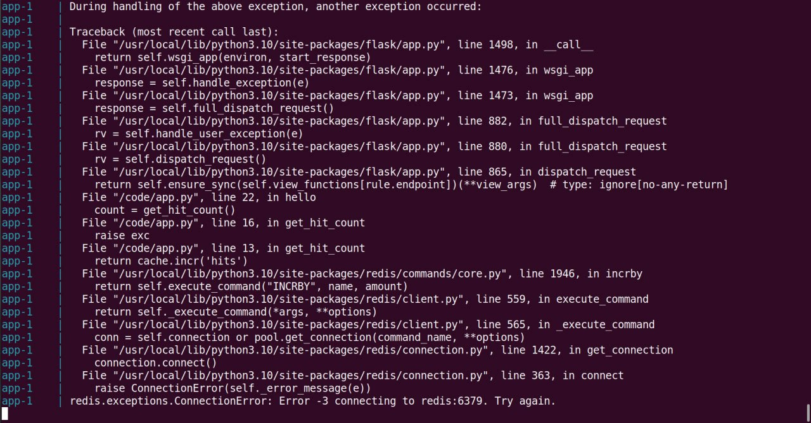

Участники: Крестьянова Елизавета, Дашкевич Олеся.
# Docker compose
## "Плохой" Docker compose
> Написать “плохой” Docker compose файл, в котором есть не менее трех “bad practices” по их написанию

Мы пишем composer.yaml для приложения Python + Flask из [официальной документации](https://docs.docker.com/compose/gettingstarted/).

```
version: "3"

services:
  app:
    build: .
    ports:
      - "8000:5000"

  redis:
    image: "redis:alpine"
    environment:
      - REDIS_PASSWORD="qwerty"
      - REDIS_USER="plida"
      - REDIS_USER_PASSWORD="qwerty"
    ports:
      - "6380:6379"
```

Запустим приложение:


И проверим с помощью curl в терминале:

.jpg>)

Приложение запоминает, сколько раз был введён этот запрос благодаря сервису redis, и выводит это количество; оно не обнуляется, даже если закрыть приложение и снова поднять.

## "Хороший" Docker compose
> Написать “хороший” Docker compose файл, в котором эти плохие практики исправлены

Мы пишем новый composer.yaml с правками:
```
version: "3"

services:
  app:
    build: .
    ports:
      - "127.0.0.1:8000:5000"
    deploy:
      resources:
        limits:
          cpus: '0.10'
          memory: 128M
        reservations:
          cpus: '0.05'
          memory: 64M


  redis:
    image: "redis:alpine"
    environment:
      - REDIS_PASSWORD=${REDIS_PASSWORD}
      - REDIS_USER=${REDIS_USER}
      - REDIS_USER_PASSWORD=${REDIS_USER_PASSWORD}
    ports:
      - "127.0.0.1:6380:6379"
    deploy:
      resources:
        limits:
          cpus: '0.10'
          memory: 128M
        reservations:
          cpus: '0.05'
          memory: 64M
```

Запустим приложение:


И снова проверим:

.jpg>)

Так как этот запрос был совершён в первый раз, приложение выводит соответствующую строку.

## Описание плохих практик и их исправление
> В Readme описать каждую из плохих практик в плохом файле, почему она плохая и как в хорошем она была исправлена, как исправление повлияло на результат

### 1. Привязка открытых портов к 0.0.0.0 хоста

Оставив порты у сервиса, например, 8080:8080, они становятся доступными каждому сетевому интерфесу системы; также появляется возможность постороним связаться напрямую с приложением, обойдя прокси. С брандмауэром проблем не должно быть, но нет гарантий, что у каждого сокомандника, работающего с приложением, он будет на устройстве.
Лучше лишний раз за пару секунд прописать, к примеру, `127.0.0.1:8080:8080` (127.0.0.1 - loopback-интерфейс).

### 2. Неограниченность ресурсов для сервисов

В первом файле compose не было прописано никаких ограничений по объёму ресурсов и памяти для программ. Это плохая практика по очевидным причинам: такой маленькой программе не нужно разрешать занимать несколько ядер ЦП или несколько гигабайт оперативной памяти в случае какой-либо ошибки. Стоит каждому сервису прописать следующее:
```
limits:
          cpus:
          memory:
reservations:
          cpus:
          memory:
```

Где reservations - минимальное количество ресурсов, которые надо выделить сервису, и limits - крайние пределы, за которые запрещено выходить.

### 3. Секреты в композе

Если какому-то сервису нужны пароли или прочая секретная информация, им следует передаваться ему, например, с помощью ${}, а не сохраняться в самих файлах. 

Поэтому в compose сервису redis пароли и логин прописываются в переменные environment:
```
      - REDIS_PASSWORD=${REDIS_PASSWORD}
      - REDIS_USER=${REDIS_USER}
      - REDIS_USER_PASSWORD=${REDIS_USER_PASSWORD}
```

Элегантнее будет передавать секреты в аттрибут [secret](https://docs.docker.com/compose/how-tos/use-secrets/) файла compose.yaml, который будет использовать информацию из загруженных файлов, токенов и других подобных мер.

## Изоляция сервисов
> После предыдущих пунктов в хорошем файле настроить сервисы так, чтобы контейнеры в рамках этого compose-проекта так же поднимались вместе, но не "видели" друг друга по сети. В отчете описать, как этого добились и кратко объяснить принцип такой изоляции.

Было прописано две сети: app_network и redis_network, и каждая из них назначена своему сервису:
```
services:
  app:
    build: .
    ports:
      - "127.0.0.1:8000:5000"
    deploy:
      resources:
        limits:
          cpus: '0.10'
          memory: 128M
        reservations:
          cpus: '0.05'
          memory: 64M
    networks:
      - app_network
redis:
    image: "redis:alpine"
    environment:
      - REDIS_PASSWORD=${REDIS_PASSWORD}
      - REDIS_USER=${REDIS_USER}
      - REDIS_USER_PASSWORD=${REDIS_USER_PASSWORD}
    ports:
      - "127.0.0.1:6380:6379"
    deploy:
      resources:
        limits:
          cpus: '0.10'
          memory: 128M
        reservations:
          cpus: '0.05'
          memory: 64M
    networks:
      - redis_network
    depends_on:
      - app

networks:
  app_network:
    driver: bridge
  redis_network:
    driver: bridge
```

То есть сервисы банально находятся в разных сетях без какой-либо связи, по которой они могли бы общаться друг с другом.

`curl 127.0.0.1:8000` приводит к вечному ожиданию ответа от приложения, `curl 127.0.0.1:5000` не может законнектится, и в консоли с запущенным приложением видно следующую ошибку:



Явно сервису app больше не удаётся связаться с сервисом redis через порт 6379.

В этом примере нет большого смысла разделять эти сервисы таким грубым методом, но в глобальном плане кастомные сети полезны для изолирования сервисов - для удобства тестирования, для безопасности и прочих случаев. 
